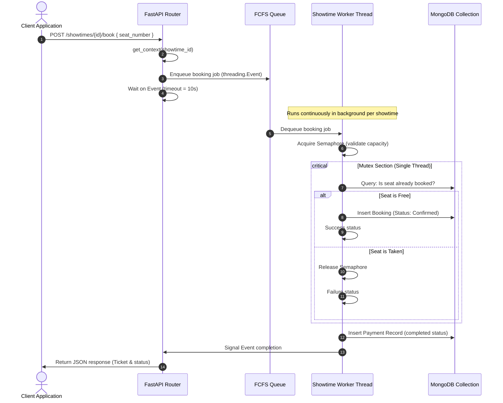

# CineBook — System Documentation & Setup Guide

Welcome to **CineBook  **, a modern, multi-role cinema booking platform powered by **FastAPI**, **MongoDB** (migrated from SQLite), and custom **OS-grade concurrency primitives** managed per showtime slot.


## Table of Contents
1. [System Architecture](#system-architecture)
2. [Database Migration (SQLite to MongoDB)](#database-migration-sqlite-to-mongodb)
3. [Concurrency Design & Seat Isolation](#concurrency-design--seat-isolation)
4. [Prerequisites](#prerequisites)
5. [Installation & Setup](#installation--setup)
6. [Running the Application](#running-the-application)
7. [Seeded Demo Accounts](#seeded-demo-accounts)
8. [API Route Reference](#api-route-reference)


## System Architecture

CineBook   is structured as a modular full-stack application. The frontend uses dynamic HTML templates powered by Jinja2, styled with dark cinema aesthetics (CSS/Bootstrap) and interactive JavaScript. The backend uses FastAPI to expose RESTful APIs and serve Web views.

```
cinebook_ _full/
├── backend/
│   ├── main.py          # FastAPI routes (REST API + page views + startup events)
│   ├── models.py        # Python models representing core entities (User, Movie, Hall, Showtime, etc.)
│   ├── database.py      # PyMongo client instance, index setup, and auto-increment logic
│   ├── schemas.py       # Pydantic request/response serialization/deserialization schemas
│   ├── auth.py          # JWT authentication token generation and verification using bcrypt
│   └── concurrency.py   # Multi-threaded showtime-isolated queues, mutexes, and semaphores
├── frontend/
│   ├── templates/       # HTML Jinja2 template views (index, booking wizard, admin/user dashboards, auth)
│   └── static/
│       ├── css/         # Dark mode-friendly styling
│       └── js/          # Authentication helpers, seat renderer, receipt rendering, & API calls
├── requirements.txt     # Python application dependency list
├── setup_mongodb.py     # Independent MongoDB database creation and seeder script
└── README.md           # This comprehensive guide
```

---

## Database Migration (SQLite to MongoDB)

The project has transitioned from a relational SQL database architecture (SQLite) to a document-based NoSQL architecture (**MongoDB**).

> [!NOTE]
> The SQLite database files `cinebook.db`, `cinebook.db-shm`, and `cinebook.db-wal` present in the root directory are legacies from v1 and are currently **not used** by the active codebase.

### Collection Mappings & Indexes
To ensure speed, consistency, and data integrity, MongoDB collections are structured with appropriate indexes:

| Collection | Key Indexes / Constraints | Purpose |
| :--- | :--- | :--- |
| `users` | `username` (Unique), `email` (Unique) | User accounts and profiles |
| `movies` | `title`, `is_active` | Film listing metadata and soft-deletion flag |
| `halls` | `name` (Unique) | Physical screens with capacities and seat configurations |
| `showtimes`| `(movie_id, hall_id, start_time)` (Unique), `is_active` | Scheduled screenings |
| `bookings` | `(showtime_id, seat_number)` (Unique), `user_id`, `status` | Ticket reservation documents |
| `payments` | `booking_id` (Unique), `transaction_id` (Unique) | Completed transactions and receipts |
| `counters` | `_id` (Primary key matching collection name) | Stores sequences to generate thread-safe auto-incrementing integer IDs |

### Thread-Safe Auto-Increment sequences
MongoDB does not support SQL-style auto-increment IDs natively. CineBook   implements auto-incrementing integer IDs utilizing MongoDB's atomic `$inc` operator on a dedicated `counters` collection:
```python
def get_next_id(db_instance, collection_name: str) -> int:
    counter = db_instance["counters"].find_one_and_update(
        {"_id": collection_name},
        {"$inc": {"seq": 1}},
        return_document=True,
        upsert=True
    )
    return counter["seq"]
```

---

## Concurrency Design & Seat Isolation

The standout feature of CineBook   is its **per-showtime isolation concurrency engine** implemented in `backend/concurrency.py`.

### The Core Problem in Cinema Booking
In a naive system, if user Alice attempts to book seat **A1** for Movie X, and user Bob attempts to book seat **B2** for Movie Y, they can block each other at the database or global application locks level. This causes unnecessary throughput degradation.

### The CineBook   Solution: Per-Showtime Lock Registry
CineBook   registers a dedicated `ConcurrencyContext` for each showtime. This means:
1. **No Inter-Showtime Blocking**: Booking requests for different screens or timings run fully in parallel.
2. **FCFS Queue**: Requests targeting the same showtime are serialized via a dedicated FIFO (`queue.Queue`) queue worker thread.
3. **Semaphore Control**: Rejection happens quickly before database hits if the hall is at full capacity.
4. **Mutex Critical Section**: Checks and inserts for seats on the same showtime are serialized to guarantee that **no two bookings can confirm the same physical seat**.



---

## Prerequisites

Ensure you have the following installed on your machine:
* **Python 3.10** or higher
* **MongoDB Community Edition** (running locally on port `27017`)
* Terminal/Shell CLI with administrative privileges (for service installation/setup if needed)

---

## Installation & Setup

Follow these steps to configure the project local environment on Windows:

### 1. Start MongoDB Service
Ensure MongoDB is running. If it runs as a background Windows Service, it starts automatically. Otherwise, start it manually from a terminal:
```powershell
# Create data directory if not existing
mkdir C:\data\db
# Start MongoDB Daemon
mongod --dbpath C:\data\db
```

### 2. Set Up Python Virtual Environment
Navigate to the root project folder and activate the existing virtual environment:
* **PowerShell**:
  ```powershell
  .\venv\Scripts\Activate.ps1
  ```
* **Command Prompt**:
  ```cmd
  .\venv\Scripts\activate.bat
  ```

### 3. Install Dependencies
Install all required libraries through pip:
```bash
pip install -r requirements.txt
```

### 4. Database Setup & Seeding
The application is designed to automatically initialize and seed itself on start. However, if you want to explicitly run a standalone setup to index and seed the database, run:
```bash
python setup_mongodb.py
```
This script creates collections, defines indexes, configures the sequential counters, and generates initial dummy data.

---

## Running the Application

### 1. Start the Development Server
With the virtual environment activated, run the following command from the project root:
```bash
venv\Scripts\python.exe -m uvicorn backend.main:app --reload
```

### 2. Access the Application
Open your web browser and navigate to:
* **Frontend UI**: [http://127.0.0.1:8000/](http://127.0.0.1:8000/)
* **Interactive API Documentation (Swagger)**: [http://127.0.0.1:8000/docs](http://127.0.0.1:8000/docs)

---

## Seeded Demo Accounts

You can log in to the system using the pre-seeded users. Passwords are case-sensitive.

| Username | Password | Role | Access Level / Dashboard |
| :--- | :--- | :--- | :--- |
| **`admin`** | `Admin@123` | `admin` | Admin dashboard (`/admin`), Full crud operations, Full audit logs |
| **`Ali`** | `Ali@123` | `user` | User dashboard (`/dashboard`), Tickets, Booking flow |
| **`maham`** | `maham@123` | `user` | User dashboard (`/dashboard`), Tickets, Booking flow |

---

## API Route Reference

### Authentication
* `POST /auth/register` - Register a new user account.
* `POST /auth/login` - Obtain a JWT bearer token.

### Movie & Hall Management
* `GET /api/movies` - Retrieve all active movies.
* `POST /api/movies` (Admin only) - Add a new movie.
* `PUT /api/movies/{id}` (Admin only) - Update movie details.
* `DELETE /api/movies/{id}` (Admin only) - Soft-delete a movie (deactivates but maintains booking archives).
* `GET /halls` (Admin only) - List existing screens.
* `POST /halls` (Admin only) - Add a new screen.

### Showtime Scheduling & Bookings
* `GET /showtimes` - Fetch active showtimes.
* `POST /showtimes` (Admin only) - Register a new showtime slot.
* `PUT /showtimes/{id}` (Admin only) - Modify showtime.
* `GET /showtimes/{id}/seats` (User only) - View vacant and occupied seat labels.
* `GET /showtimes/{id}/seats/admin` (Admin only) - View seat map with booker usernames.
* `POST /showtimes/{id}/book` (User only) - Queue a ticket booking request.
* `GET /me/tickets` (User only) - Retrieve a list of booked tickets for the current user.
* `GET /admin/audit` (Admin only) - View audit history of all confirmed bookings.
* `GET /admin/audit/{id}` (Admin only) - View bookings specific to a single showtime.

### General Health Status
* `GET /health` - View API server heartbeat verification.
